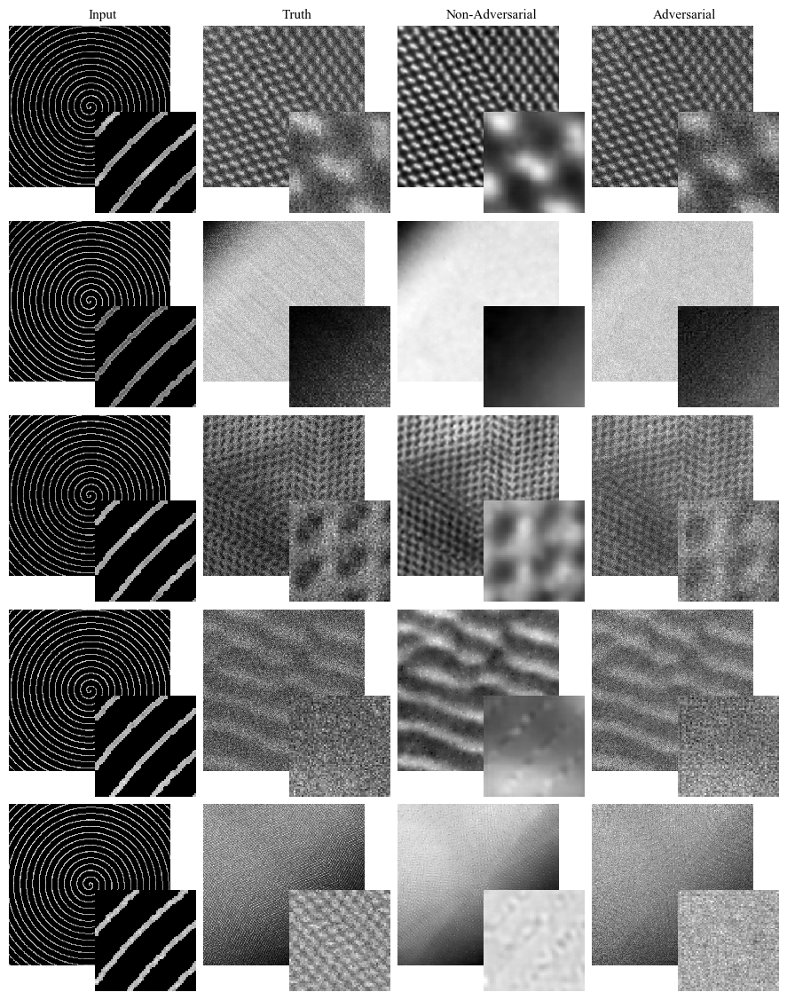
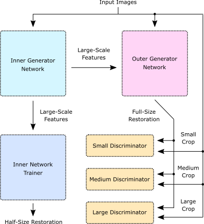

# Partial Scanning Transmission Electron Microscopy

[](https://doi.org/10.5281/zenodo.3662481)

This repository is for the [preprint](https://arxiv.org/abs/1905.13667)|paper "Partial Scanning Transmission Electron Microscopy with Deep Learning". It contains TensorFlow code for a multi-scale generative adversarial network that completes 512x512 electron micrographs from partial scans. For spiral scans selected by a binary mask with 1/17.9 px coverage and non-adversarial pre-training, it has a 3.8% root mean square intensity error.

<p align="center">
  
</p>

Examples show adversarial and non-adversarial completions of test set 512×512 1/20 coverage blurred spiral partial scans.  Adversarial completions have realistic noise characteristics and colouration whereas non-adversarial completions are blurry. The bottom row shows a failure case where detail is too fine for the generator to resolve. Enlarged 64×64 regions from the top left of each image are inset to ease comparison.

A set of directories for spiral scans selected with binary masks is in `pstem`. Coverages are listed in `notes.txt` files. Each directory contains source code, notes, and script variants used to calculate test set performances and create sheets of examples. 

A set of directories for systematic error experiments is in `systematic_errors`. 

## Architecture

Our training configuration can be partitioned into six subnetworks: an inner and outer generator, inner generator trainer and small, medium and large scale discriminators. The generators are all that is needed for inference.

<p align="center">
  
</p>

The  inner  generator  produces  large-scale  features  from  inputs. These are mapped to half-size completions by a trainer network and recombined with the input to generate full-size completions by the outer generator.  Multiple discriminators assess multi-scale crops from input images and full-size completions.

## Example Usage

This short script is available as `inference.py` and gives an example of inference where the generator is loaded once to complete multiple scans:

```python
from inference import Generator, get_example_scan, disp

#Use get_example_scan to select an example partial scan, ground truth pair from the project repository
#Try replacing this with your own (partial scan, ground truth) pair!
partial_scan, truth = get_example_scan() #Uses one of the examples from this repo

#Initialize generator so it's ready for repeated use
my_ckpt_dir = "path/to/model/checkpoint/" #Replace with path to your checkpoint
gen = Generator(ckpt_dir=my_ckpt_dir)

#Complete the scan
complete_scan = gen.infer(crop) 

#The generator can be reused multiple times once it has been initialised
# ... 

#Display results
disp(partial_scan) #Partial scan to be completed
disp(truth) #Ground truth
disp(complete_scan) #Scan completed by neural network
```

## Download

Training and inference scripts can be downloaded or cloned from this repository

```
git clone https://github.com/Jeffrey-Ede/partial-STEM.git
cd partial-STEM
```

## Dependencies

This neural network was trained using TensorFlow and requires it and other common python libraries. Most of these libraries come with modern python distributions by default. If you don't have some of these libraries, they can be installed using pip or another package manager. We used python version 3.6.

* tensorFlow
* numpy
* cv2
* functools
* itertools
* collections
* six
* os
* argparse
* random
* scipy
* Image
* time
* PIL

## Training

To continue training the neural network; from scratch or to fine-tune it, you will need to adjust some of the variables at the top of `train.py`. Specifically, variables indicating the location of your datasets and locations to save logs and checkpoints to. Note that there may be minor differences between the script and the paper due to active development. 

The last saved checkpoint for a fully trained 1/20 px coverage system of neural networks is available [here](https://drive.google.com/open?id=1jkf9iSnarcuj2uRmsWmCEbghfncgWdXz). A 1/40 px coverage model is also available. Both networks were trained on artificially noisy scans.


## Training Data

A training dataset with 161069 non-overlapping 512x512 crops from STEM images is available [here](https://github.com/Jeffrey-Ede/datasets/wiki).

## Misc Scripts

Python scripts used to create some of the images in our paper are in the `misc` folder.

## Contact

Jeffrey M. Ede: j.m.ede@warwick.ac.uk  
Richard Beanland: r.beanland@warwick.ac.uk
